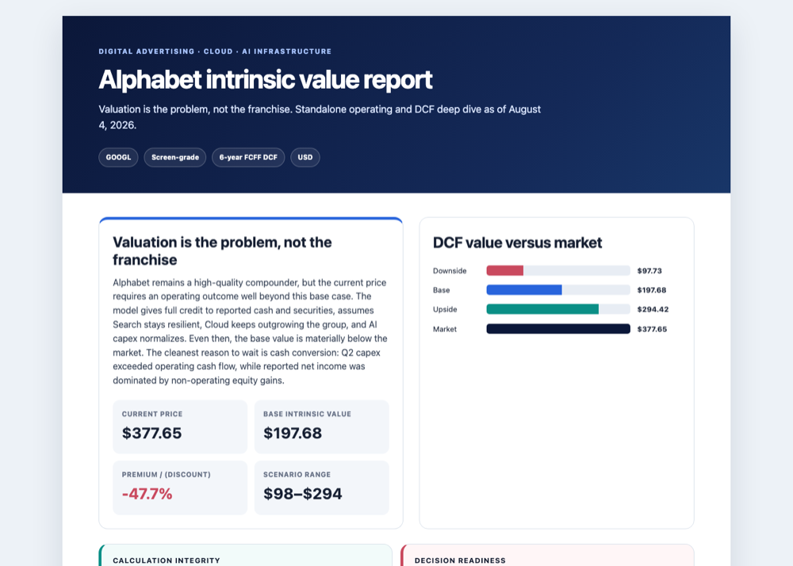
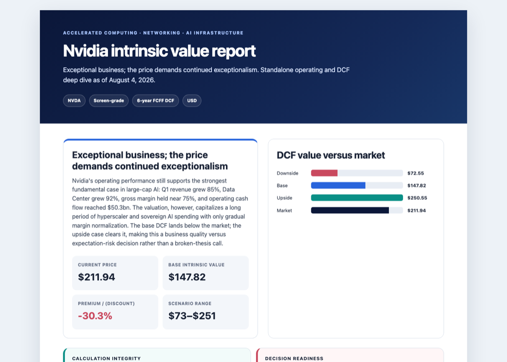

# Equity Valuation Reports

Standalone intrinsic-value reports for individual companies, each built as a
self-contained HTML report paired with a formula-driven FCFF DCF workbook —
scenario analysis, reverse DCFs, sensitivities, and a full model-cell
citation ledger.

**Live site:** [jainabhishek.github.io/equity-valuation-reports](https://jainabhishek.github.io/equity-valuation-reports/)

## Reports

| | Alphabet (GOOGL) | Nvidia (NVDA) |
| --- | --- | --- |
| |  |  |
| Stance | Valuation is the problem, not the franchise | Exceptional business; the price demands continued exceptionalism |
| Current price | $377.65 | $211.94 |
| Base intrinsic value | $197.68 | $147.82 |
| Scenario range | $98 – $294 | $73 – $251 |
| Premium / (discount) to market | **-47.7%** | **-30.3%** |
| Report | [Open →](https://jainabhishek.github.io/equity-valuation-reports/alphabet/report.html) | [Open →](https://jainabhishek.github.io/equity-valuation-reports/nvidia/report.html) |
| Workbook | [Download](alphabet/banker_formula_workbook.xlsx) | [Download](nvidia/banker_formula_workbook.xlsx) |

Valuation date for both: **August 4, 2026** (regular-session closing prices).

## Contents

- [`index.html`](index.html) — landing page (served via GitHub Pages)
- [`alphabet/`](alphabet/) — Alphabet (GOOGL) intrinsic-value report
- [`nvidia/`](nvidia/) — Nvidia (NVDA) intrinsic-value report
- [`build_reports.py`](build_reports.py) — generator script for both reports

Each company folder contains:

| File | Description |
| --- | --- |
| `report.html` | Primary human-readable deliverable: thesis, operating deep dive, valuation, sources |
| `banker_formula_workbook.xlsx` | Formula-driven FCFF DCF workbook (dashboard, scenarios, reverse DCF, sensitivities, checks, sources) |
| `plan.json` | Normalized DCF plan and assumptions |
| `manifest.json` | Deliverable manifest describing the artifacts in the folder |
| `model_citations.json` | Model-cell citation ledger tying workbook cells back to sources |
| `banker_formula_workbook_run_log.json` | Build/validation run log for the workbook |

`build_reports.py` at the repo root is the generator script used to produce
both reports (six-year FCFF DCF, mid-year convention, Gordon-growth terminal
value; downside/base/upside scenarios; controlled reverse DCFs).

## Methodology

- Six-year unlevered free-cash-flow (FCFF) DCF, mid-year convention, Gordon-growth terminal value.
- Enterprise value is bridged to equity using the latest reported cash, securities, debt, leases, preferred stock where applicable, and diluted shares.
- Public filings and reported balance-sheet inputs are sourced; forecasts, normalized beta/ERP, and terminal assumptions are independent analyst estimates — not management guidance or consensus.
- Each workbook validates against the investment-banking DCF plan schema, recalculates with **1,349 formulas and zero errors**, and ties scenario outputs and reverse DCFs to independent calculations.
- Deliverables are explicitly labeled **screen-grade**, not decision-grade — a structured starting point for further diligence, not a final call.

## Disclaimer

These reports are shared for informational and educational purposes only and
do not constitute investment advice, a recommendation, or an offer to buy or
sell any security. Forecasts and assumptions are the author's independent
estimates and may be wrong. Do your own research and consult a licensed
financial advisor before making investment decisions.

## License

Code (`build_reports.py`) is licensed under [MIT](LICENSE). Report content
(analysis, narrative, figures, workbooks) is provided as-is for informational
use — see the Disclaimer above.
